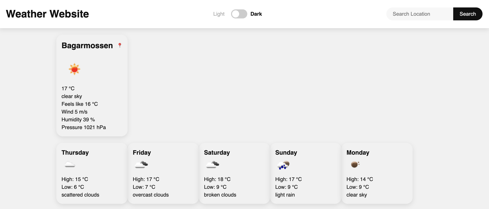
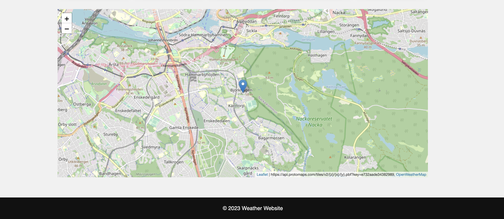
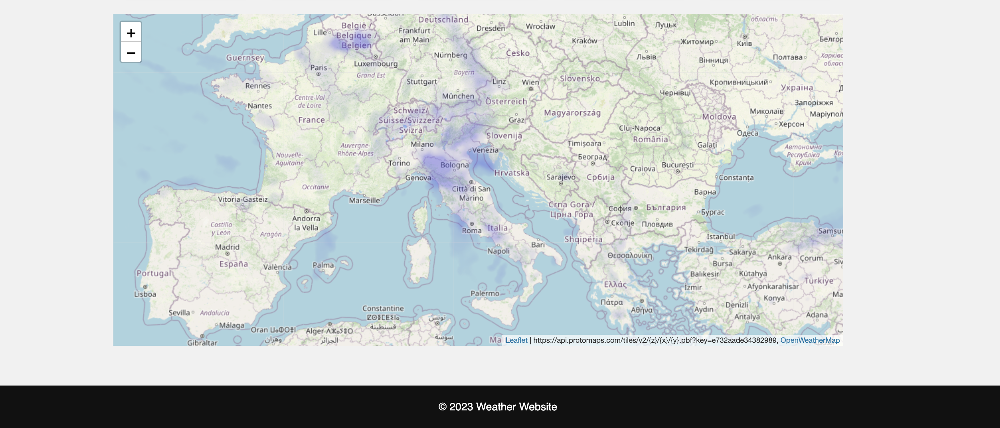
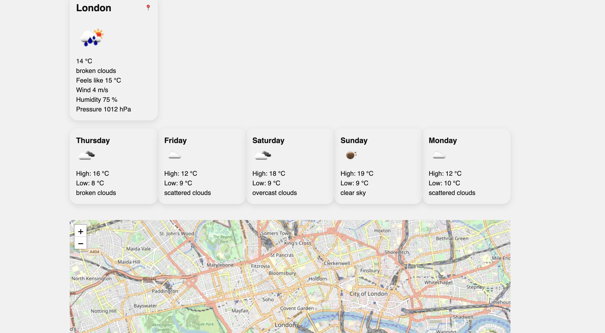
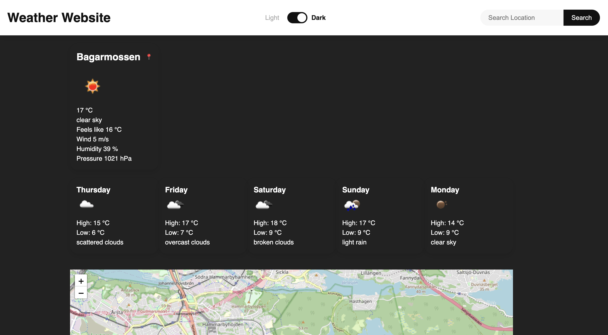

## Weather Website 🌞
This weather website provides users with up-to-date weather information for any location in the world. The website is built using CSS, HTML, and JavaScript and incorporates AI tools to enhance user experience.

## Description
* A weather website that provides users with up-to-date weather information for any location in the world. This is a part of the KTH course DD1349 Project in Introduction to Computer Science. The project is four week long project where we are supposed to use AI tools in the developing process. 

## Features
* 🌡️ Current weather conditions: Users can view the current temperature, humidity, wind speed, and other weather conditions for any location in the world.
* 🌤️ Weather forecast: Users can view a forecast for any location in the world, including high and low temperatures.
* 🗺️ Interactive map: The website features an interactive map that allows users to view weather information for different locations by clicking on a specific point on the map.

## Technologies Used 🚀
* HTML: The website's structure and content are built using HTML.
* CSS: The website's styling and layout are created using CSS.
* JavaScript: Will be used for the interactive map and `OpenWeatherMap` API.
* 💬 OpenAI ChatGPT: We will use `OpenAI's ChatGPT` in the developing process. It will be used in the programming of the webiste to enhance the user experience. For example, the interactive map. With our programming experience and the help of the AI tool, we plan to create a more interactive map.
* 📈 GitHub Copilot: We will also use `GitHub Copilot` in the developing process as an integrated part of VSCode. It is also an AI tool, this will help us to write code faster and more efficiently.
* 🌍 OpenWeatherMap API: The website uses `OpenWeatherMap` API to retrieve weather data for any location in the world.
* 🗺️ Protomap API: From `https://protomaps.com/` we use our API key that displays the interactive map. By using `Leaflet`, the interactive map can be displayed together with a layer of precipitation data from `OpenWeatherMap`. 

## Timline 📅
* On our repo under `issues` you can see our `milestones` that include detailed planning for what has been done during every week of the project.

## Features

### Today's Weather Forecast and Upcoming 5 Days

The website provides a detailed weather forecast for today and the next 5 days. Users can easily view the temperature, precipitation, and other relevant information.

### Interactive Map with Current Location

The interactive map feature allows users to explore weather conditions around the world. By accessing the user's current location, the map centers on their area and provides real-time weather updates.

### Precipitation (Rain) Layer

In addition to the interactive map, there is a precipitation layer that displays rain changes globally. Users can quickly identify regions experiencing rainfall at any given moment.

### City Search Functionality

The website includes a search function that enables users to find weather information for specific cities. When a city is searched (e.g., London), the weather details and the upcoming 5-day forecast are updated accordingly. The interactive map also displays the searched city.

### Light and Dark Mode

To enhance user experience, the website offers a toggle that allows users to switch between Light and Dark modes. This feature provides flexibility and ensures readability in different environments.

## Setup 🛠️
To set up the weather website on your local machine, follow these steps:

* Clone the repository: git clone `git@github.com:oscarjonssson/projektuppgift-inda-22.git`
* Install the required dependencies: npm install
* Start the server: npm start

## Contributors 🤝
Oscar Jonsson | Filip Dimitrijevic
